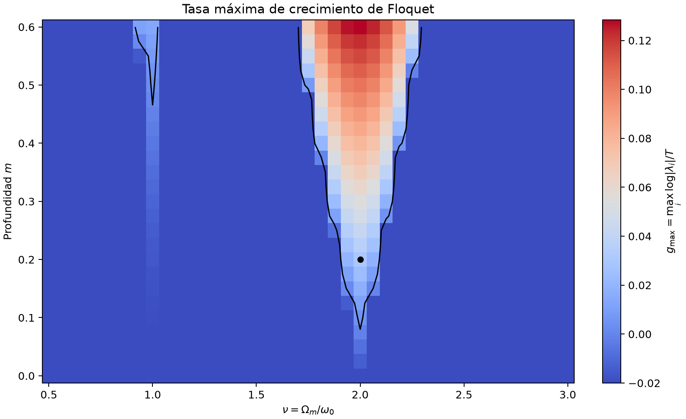
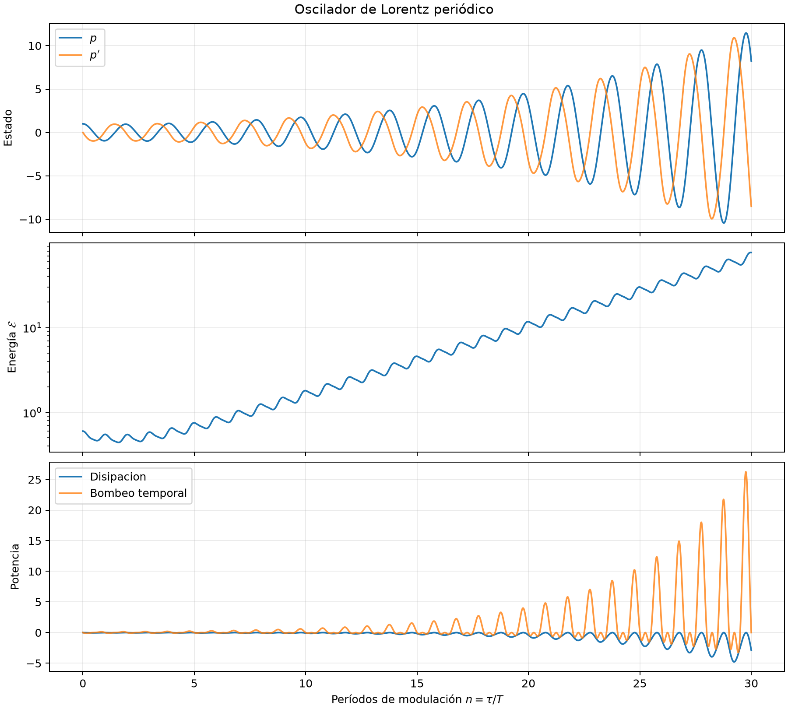
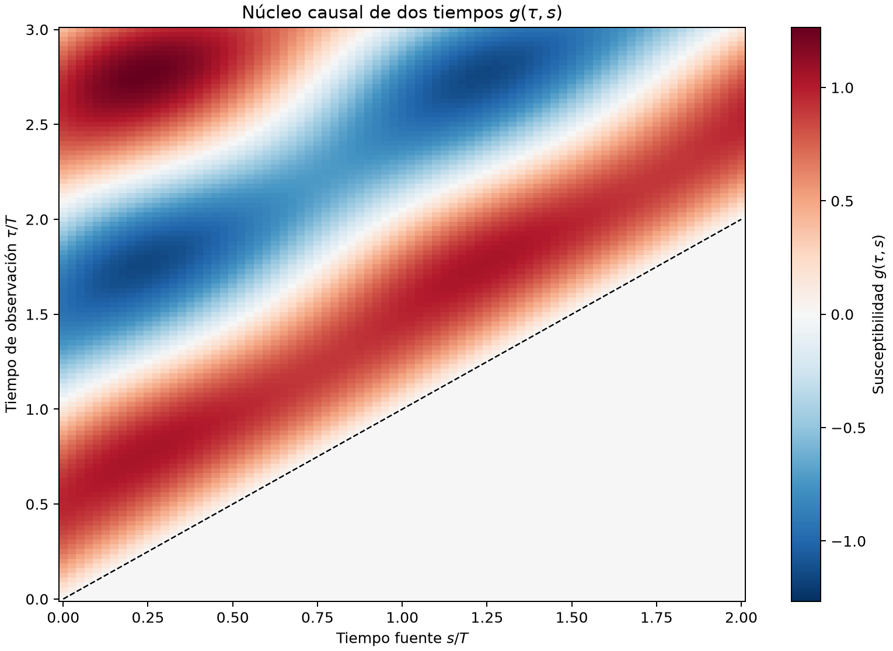
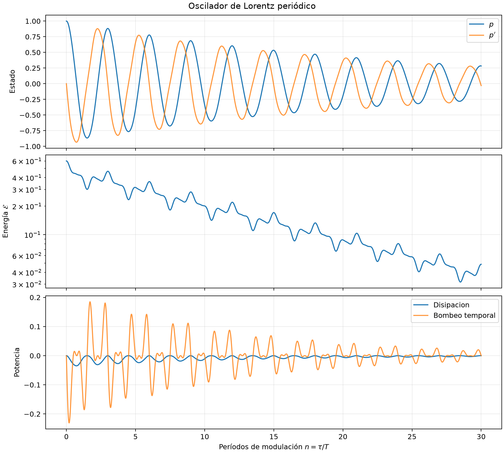
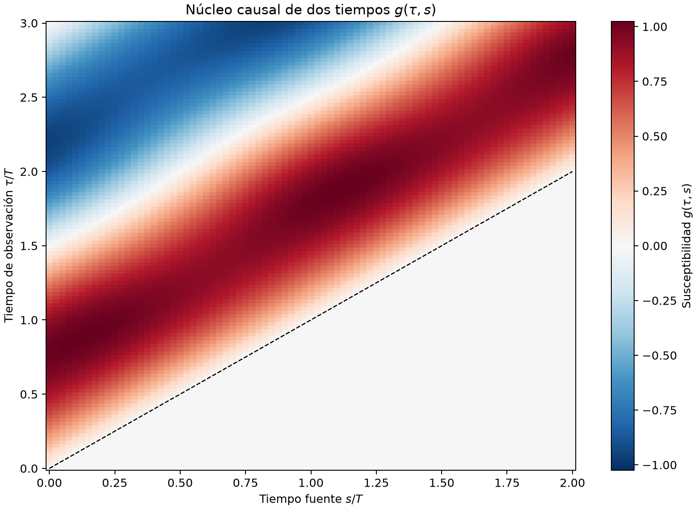

# Canales electromagnéticos causales espacio-temporales

Base computacional para estudiar la capacidad física de canales gobernados por
Maxwell en medios dispersivos y variables en el tiempo.

## Primer hito

El modelo inicial es un oscilador de Lorentz adimensional con frecuencia de
resonancia modulada periódicamente:

$$
p''(\tau)+2\zeta p'(\tau)
+\left[1+m\cos(\nu\tau+\phi)\right]p(\tau)=f(\tau).
$$

Aquí, $\tau=\omega_0t$, $\zeta=\gamma/(2\omega_0)$,
$m$ es la profundidad de modulación y $\nu=\Omega_m/\omega_0$.
El primer experimento calcula la matriz monodrómica $M$, los multiplicadores de
Floquet $\lambda_i$, las tasas de crecimiento $g_i$ y el balance de energía.

## Resultados visuales

### Mapa de estabilidad de Floquet

La curva negra representa la frontera $g_{\max}=0$ entre los regímenes estable
e inestable. La lengua principal aparece alrededor de $\nu=2$ y la lengua
secundaria alrededor de $\nu=1$ para modulaciones más intensas.



### Régimen resonante e inestable

Para

$$
\zeta=0.02,\qquad m=0.20,\qquad \nu=2,
$$

el radio espectral satisface

$$
\rho(M)\approx1.09865>1.
$$

La energía aumenta porque el bombeo temporal supera la disipación en una de
las direcciones de Floquet.



El núcleo causal permanece exactamente nulo para $\tau\le s$ y satisface la
periodicidad conjunta $g(\tau+T,s+T)=g(\tau,s)$.



### Benchmark estable

Al mover la modulación a $\nu=3$, obtenemos

$$
\rho(M)\approx0.95898<1,
\qquad
g_{\max}\approx-0.02.
$$

Este régimen será la referencia para construir el canal armónico de Floquet y
compararlo con la representación causal en el dominio temporal.





## Instalación

En PowerShell:

```powershell
py -3.13 -m venv .venv
.\.venv\Scripts\Activate.ps1
python -m pip install --upgrade pip
python -m pip install -e ".[dev,notebook]"
python -m ipykernel install --prefix .venv --name causal-em --display-name "Python (causal-em)"
```

La dependencia de optimización para etapas posteriores se instala con:

```powershell
python -m pip install -e ".[optimization]"
```

## Ejecución

```powershell
pytest
causal-em-first --with-map
jupyter lab
```

El comando `causal-em-first` guarda figuras y un resumen JSON en
`results/first_experiment/`. El cuaderno inicial está en
`notebooks/01_lorentz_floquet.ipynb`.

## Criterios de validez

- La matriz numérica debe coincidir con la exponencial matricial en el caso sin
  modulación.
- El determinante de la monodromía debe satisfacer la identidad de Liouville
  $\det M=\exp(-2\zeta T)$.
- El balance numérico de energía debe reproducir exactamente los términos de
  disipación y trabajo de modulación al refinar la malla temporal.
- El límite $m\to0$ debe recuperar el oscilador de Lorentz estacionario.
- El núcleo causal debe anularse para $\tau\le s$, obedecer la composición
  del propagador y satisfacer $g(\tau+T,s+T)=g(\tau,s)$.

La derivación y el alcance de este primer modelo se documentan en
`docs/01_modelo_lorentz_floquet.md`.

## Marco teórico y ruta de estudio

El marco matemático y físico completo del proyecto —Maxwell, respuesta causal de
dos tiempos, dispersión Lorentz–Drude, Floquet, energía del bombeo, reciprocidad,
ruido ciclostacionario, canal MIMO y capacidad— está en
[`docs/03_marco_teorico.md`](docs/03_marco_teorico.md). Incluye un diagnóstico de
prerrequisitos, una ruta de nivelación de dieciséis semanas y bibliografía primaria
actualizada hasta agosto de 2026.
